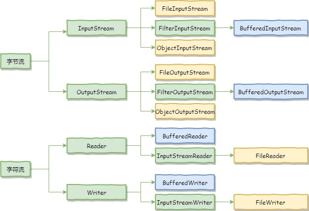

# 1. File类

`java.io.File` 类是文件和目录路径名的**抽象表示**，主要用于文件和目录的创建、查找和删除等操作。

## 1.1 静态成员变量

* `File.separator`：获取文件分隔符，Windows为`\`，Linux为`/`
* `pathSeparator`：获取路径分隔符，Windows为`;`，Linux为`:`

```java
System.out.println(File.separator); // print \
System.out.println(File.pathSeparator); // print ;
```

## 1.2 构造方法

- `public File(String pathname) ` ：通过将给定的**路径名字符串**转换为抽象路径名来创建新的 File实例。  
- `public File(String parent, String child) ` ：从**父路径名字符串和子路径名字符串**创建新的 File实例。
- `public File(File parent, String child)` ：从**父抽象路径名和子路径名字符串**创建新的 File实例。  
  * 父路径是File类型，可以使用File的属性和方法。

- 构造举例：

```java
File f1 = new File("D:\\JavaEE\\IO\\FileDemo1.java");

File f2 = new File("D:\\JavaEE\\IO", "FileDemo1.java");

File f3 = new File("D:\\JavaEE\\IO");
File f4 = new File(f3, "FileDemo1.java");
```

> 1. 一个File对象代表硬盘中实际存在的一个文件或者目录。
> 2. 无论该路径下是否存在文件或者目录，都不影响File对象的创建。

## 1.3  常用方法

### 1.3.1 获取功能的方法

- `public String getAbsolutePath() ` ：返回此File的绝对路径名字符串。
- ` public String getPath() ` ：将此File转换为路径名字符串。 
- `public String getName()`  ：返回由此File表示的文件或目录的名称。  
- `public long length()`  ：返回由此File表示的文件的长度

* 常用方法举例：

```java
File f1 = new File("01-File\\src\\FileDemo1.java");
System.out.println("文件绝对路径:" + f1.getAbsolutePath());
System.out.println("文件构造路径:" + f1.getPath());
System.out.println("文件名称:" + f1.getName());
System.out.println("文件长度:" + f1.length() + "字节");

File f2 = new File("01-File\\src\\");
System.out.println("文件绝对路径:" + f2.getAbsolutePath());
System.out.println("文件构造路径:" + f2.getPath());
System.out.println("文件名称:" + f2.getName());
System.out.println("文件长度:" + f2.length() + "字节");
```

* 输出结果

```bash
文件绝对路径:D:\Projects\JavaEE\IO\01-File\src\FileDemo1.java
文件构造路径:01-File\src\FileDemo1.java
文件名称:FileDemo1.java
文件长度:200字节

文件绝对路径:D:\Projects\JavaEE\IO\01-File\src
文件构造路径:.\01-File\src
文件名称:src
文件长度:0字节
```

### 1.3.2 判断功能的方法

- `public boolean exists()` ：此File表示的文件或目录是否实际存在。
- `public boolean isDirectory()` ：此File表示的是否为目录。
- `public boolean isFile()` ：此File表示的是否为文件

### 1.3.3 创建删除功能的方法

- `public boolean createNewFile()` ：当且仅当具有该名称的文件尚不存在时，创建一个新的空文件。 
- `public boolean delete()` ：删除由此File表示的文件或目录。  
- `public boolean mkdir()` ：创建由此File表示的目录。
- `public boolean mkdirs()` ：创建由此File表示的目录，包括任何必需但不存在的父目录。

### 1.3.4 遍历目录的方法

- `public String[] list()` ：返回一个String数组，表示该File目录中的所有子文件或目录。

- `public File[] listFiles()` ：返回一个File数组，表示该File目录中的所有的子文件或目录。

# 2. IO概述

## 2.1 分类

根据数据的流向分为：**输入流**和**输出流**。

- **输入流** ：把数据从`其他设备`上读取到`内存`中的流。 
- **输出流** ：把数据从`内存` 中写出到`其他设备`上的流。

格局数据的类型分为：**字节流**和**字符流**。

- **字节流** ：以字节为单位，读写数据的流。
- **字符流** ：以字符为单位，读写数据的流。

## 2.2 顶级父类

|            | **输入流**  |  **输出流**  |
| :--------: | :---------: | :----------: |
| **字节流** | InputStream | OutputStream |
| **字符流** |   Reader    |    Writer    |

## 2.3 概览



# 3. 字节流

## 3.1 字节输出流【OutputStream】

`java.io.OutputStream `抽象类是表示字节输出流的所有类的超类，将指定的字节信息写出到目的地。它定义了字节输出流的基本共性功能方法。

* `public void close()`：关闭此输出流并释放与此流相关联的任何系统资源。
* `public void flush()`：刷新此输出流并强制任何缓冲的输出字节被写出。
* `public void write(byte[] b)`：将 b.length字节从指定的字节数组写入此输出流。
* `public void write(byte[] b, int off, int len)` ：从指定的字节数组写入 len字节，从偏移量 off开始输出到此输出流。  
* `public abstract void write(int b)` ：将指定的字节输出流。

> close方法，当完成流的操作时，必须调用此方法，释放系统资源。

### 3.1.1 FileOutputStream

`java.io.FileOutputStream `类是文件输出流，用于将数据写出到文件。

#### 3.1.1.1 构造方法

当你创建一个流对象时，必须传入一个文件路径。该路径下，如果没有这个文件，会创建该文件。如果有这个文件，会清空这个文件的数据。

- `public FileOutputStream(File file)`：创建文件输出流以写入由指定的 File对象表示的文件。 
- `public FileOutputStream(String name)`： 创建文件输出流以指定的名称写入文件。

```java
public class FileOutputStreamDemo1 {
    public static void main(String[] args) throws IOException {
        File f = new File("01-字节流\\FileOutputStreamDemo1.txt");
        
        FileOutputStream fos = new FileOutputStream(f);
        fos.close();
    }
}
```

#### 3.1.1.2 写出字节数据

1. `write(int b)`：每次可以写出一个字节数据

```java
// 在文件中写入abc
fos.write(97);
fos.write(98);
fos.write(99);
```

2. `write(byte[] b)`：每次可以写出数组中的数据

```java
// 在文件中写入Hello World !
byte[] b = "Hello World !".getBytes();
fos.write(b);
```

3. `write(byte[] b, int off, int len)`：每次写出从off索引开始，len个字节

```java
// 在文件中写入ell
fos.write(b, 1, 3);
```

#### 3.1.1.3 追加写入

- `public FileOutputStream(File file, boolean append)`： 创建文件输出流以写入由指定的 File对象表示的文件。  
- `public FileOutputStream(String name, boolean append)`： 创建文件输出流以指定的名称写入文件。

> * 系统中的换行：
>   * Windows系统里，每行结尾是 `回车+换行` ，即`\r\n`；
>   * Unix系统里，每行结尾只有 `换行` ，即`\n`；
>   * Mac系统里，每行结尾是 `回车` ，即`\r`。从 Mac OS X开始与Linux统一。

## 3.2 字节输入流【InputStream】

`java.io.InputStream `抽象类是表示字节输入流的所有类的超类，可以读取字节信息到内存中。它定义了字节输入流的基本共性功能方法。

- `public void close()` ：关闭此输入流并释放与此流相关联的任何系统资源。    
- `public abstract int read()`： 从输入流读取数据的下一个字节。 
- `public int read(byte[] b)`： 从输入流中读取一些字节数，并将它们存储到字节数组 b中 。

### 3.2.1 FileInputStream

#### 3.2.1.1 构造方法

- `FileInputStream(File file)`
- `FileInputStream(String name)`

#### 3.2.1.2 读取字节数据

1. `read()`：每次可以读取一个字节的数据，提升为int类型，读取到文件末尾，返回-1

```java
int read;
while ((read = fis.read()) != -1) {
    System.out.print((char) read);
}
```

2. `read(byte[] b)`：每次读取b的长度个字节到数组中，返回读取到的有效字节个数，读取到末尾时，返回-1

```java
byte[] b = new byte[4];
int len;
while ((len = fis.read(b)) != -1) {
    // 如果最后读取的字节数小于4，则b中的字符不会被完全替换，所以需要获取len
    System.out.print(new String(b, 0, len));
}
```

## 3.3 使用字节流实现图片复制

```java
public static void copy(String src, String dst) throws IOException {
    FileInputStream fis = new FileInputStream(new File(src));
    FileOutputStream fos = new FileOutputStream(new File(dst));

    byte[] b = new byte[1024];
    int len;

    while ((len = fis.read(b)) != -1) {
        fos.write(b, 0, len);
    }

    fos.close();
    fis.close();
}
```

# 4. 字符流

当使用字节流读取文本文件时，就是遇到中文字符时，可能不会显示完整的字符，那是因为一个中文字符可能占用多个字节存储。所以Java提供一些字符流类，以字符为单位读写数据，专门用于处理文本文件。

## 4.1 字符输入流【Reader】

`java.io.Reader`抽象类是表示用于读取字符流的所有类的超类，可以读取字符信息到内存中。它定义了字符输入流的基本共性功能方法。

- `public void close()` ：关闭此流并释放与此流相关联的任何系统资源。    
- `public int read()`： 从输入流读取一个字符。 
- `public int read(char[] cbuf)`： 从输入流中读取一些字符，并将它们存储到字符数组 cbuf中 。

### 4.1.1 FileReader

#### 4.1.1.1 构造方法

- `FileReader(File file)`： 创建一个新的 FileReader ，给定要读取的File对象。   
- `FileReader(String fileName)`： 创建一个新的 FileReader ，给定要读取的文件的名称。

#### 4.1.1.2 读取字符数据

1. `read`：读取一个字符的数据，提升为int类型，读取到文件末尾，返回-1

```java
int read;
while ((read = fr.read()) != -1) {
    System.out.print((char) read);
}
```

2. `read(char[] cbuf)`：每次读取b的长度个字符到数组中，返回读取到的有效字符个数，读取到末尾时，返回-1

```java
char[] cbuf = new char[3];
int len;
while ((len = fr.read(cbuf)) != -1){
    System.out.print(new String(cbuf, 0, len));
}
```

## 4.2 字符输出流【Writer】

`java.io.Writer `抽象类是表示用于写出字符流的所有类的超类，将指定的字符信息写出到目的地。它定义了字节输出流的基本共性功能方法。

- `void write(int c)` 写入单个字符。
- `void write(char[] cbuf) `写入字符数组。 
- `abstract  void write(char[] cbuf, int off, int len) `写入字符数组的某一部分,off数组的开始索引,len写的字符个数。 
- `void write(String str) `写入字符串。 
- `void write(String str, int off, int len)` 写入字符串的某一部分,off字符串的开始索引,len写的字符个数。
- `void flush() `刷新该流的缓冲。  
- `void close()` 关闭此流，但要先刷新它。 

### 4.2.1 FileWriter

#### 4.2.1.1 构造方法

- FileWriter(File file)`： 创建一个新的 FileWriter，给定要读取的File对象。   
- `FileWriter(String fileName)`： 创建一个新的 FileWriter，给定要读取的文件的名称。

#### 4.2.1.2 基本写出数据

1. `write()`

```java
fw.write(97); // 写出第1个字符
fw.write('b'); // 写出第2个字符
fw.write('C'); // 写出第3个字符
fw.write(30000); // 写出第4个字符，中文编码表中30000对应一个汉字
```

> * 如果不关闭,数据只是保存到缓冲区，并未保存到文件.
>
> * `flush` ：刷新缓冲区，流对象可以继续使用。
> * `close`:先刷新缓冲区，然后通知系统释放资源。流对象不可以再被使用了。

2. `write(char[] cbuf)` 和 `write(char[] cbuf, int off, int len)`

```java
char[] cbuf = {'a', 'b', 'c', '\r', '\n'};
fw.write(cbuf);
fw.write(cbuf, 1, 2);
```

3. `write(String str)` 和 `write(String str, int off, int len)` 

```java
String str = "你好 World ！";
fw.write(str);
fw.write("\r\n");
fw.write(str, 1, 1);
```

> 字符流，只能操作文本文件，不能操作图片，视频等非文本文件。
>
> 当我们单纯读或者写文本文件时，使用字符流，其他情况使用字节流。

# 5. 属性集

`java.util.Properties ` 继承于` Hashtable` ，来表示一个持久的属性集。它使用键值结构存储数据，每个键及其对应值都是一个字符串。该类也被许多Java类使用，比如获取系统属性时，`System.getProperties` 方法就是返回一个`Properties`对象。

## 5.1 Properties

### 5.1.1 构造方法

* `public Properties()` :创建一个空的属性列表。

```java
Properties pro = new Properties();
```

### 5.1.2 基本的存储方法

- `public Object setProperty(String key, String value)` ： 保存一对属性。  
- `public String getProperty(String key) ` ：使用此属性列表中指定的键搜索属性值。
- `public Set<String> stringPropertyNames() ` ：所有键的名称的集合。

```java
pro.setProperty("id", "001");
pro.setProperty("name", "小明");
pro.setProperty("age", "18");

System.out.println(pro); // {age=18, name=小明, id=001}
```

```java
System.out.println(pro.getProperty("id")); // 001
System.out.println(pro.getProperty("name")); // 小明
System.out.println(pro.getProperty("age")); // 18
```

```java
Set<String> keys = pro.stringPropertyNames();
for (String key : keys) {
    System.out.println(pro.getProperty(key));
}
```

### 5.1.3 与流相关的方法

* `public void load(InputStream inStream)`： 从字节输入流中读取键值对。 

> 文本中的数据，必须是键值对形式，可以使用空格、等号、冒号等符号分隔。
>
> 例如：
>
> ​	id=001
> ​	name=小明
> ​	age 18
> ​	score:100

```java
Properties pro = new Properties();

pro.load(new FileReader("03-Properties\\read.properties"));

for (String key : pro.stringPropertyNames()) {
    System.out.println(key + "---" + pro.getProperty(key));
}

// 输出结果
//age---18
// name---小明
// score---100
// id---001
```

# 6. 缓冲流

## 6.1 概述

缓冲流,也叫高效流，是对4个基本的流的增强，所以也是4个流，按照数据类型分类：

- **字节缓冲流**：`BufferedInputStream`，`BufferedOutputStream` 
- **字符缓冲流**：`BufferedReader`，`BufferedWriter`

缓冲流的基本原理，是在创建流对象时，会创建一个内置的默认大小的缓冲区数组，通过缓冲区读写，减少系统IO次数，从而提高读写的效率。

## 6.2 字节缓冲流

### 6.2.1 构造方法

- public BufferedInputStream(InputStream in)` ：创建一个 新的缓冲输入流。 
- `public BufferedOutputStream(OutputStream out)`： 创建一个新的缓冲输出流。

## 6.3 字符缓冲流

### 6.3.1 构造方法

- `public BufferedReader(Reader in)` ：创建一个 新的缓冲输入流。 
- `public BufferedWriter(Writer out)`： 创建一个新的缓冲输出流。

### 6.3.2 特有方法

- BufferedReader：`public String readLine()`: 读一行文字。 
- BufferedWriter：`public void newLine()`: 换行，写一行行分隔符,由系统属性定义符号。 

# 7. 序列化

## 7.1 ObjectOutputStream

### 7.1.1 构造方法

* `public ObjectOutputStream(OutputStream out) `： 创建一个指定OutputStream的ObjectOutputStream。

```java
ObjectOutputStream oos = new ObjectOutputStream(new FileOutputStream("06-序列化\\student.txt"));
```

### 7.1.2 序列化操作

1. 一个对象要想序列化，必须满足两个条件:
   * 该类必须实现`java.io.Serializable ` 接口
   * 该类的所有属性必须是可序列化的。如果有一个属性不需要可序列化的，则该属性必须注明是瞬态的，使用`transient` 关键字修饰。
2. `public final void writeObject (Object obj)` : 将指定的对象写出。

```java
oos.writeObject(st1);
```

## 7.2 ObjectInputStream

### 7.2.1 构造方法

* `public ObjectInputStream(InputStream in) `： 创建一个指定InputStream的ObjectInputStream。

```java
ObjectInputStream ois = new ObjectInputStream(new FileInputStream("06-序列化\\student.txt"));
```

### 7.2.2 反序列化操作1

* `public final Object readObject ()` : 读取一个对象。

```java
Student st1 = null;
st1 = (Student) ois.readObject();
```

### 7.2.2 反序列化操作1

如果序列化后，修改了类的属性，再反序列化的时候会报错：

* 该类的序列版本号与从流中读取的类描述符的版本号不匹配 
* 该类包含未知数据类型 
* 该类没有可访问的无参数构造方法 

Serializable` 接口给需要序列化的类，提供了一个序列版本号。`serialVersionUID` 该版本号的目的在于验证序列化的对象和对应类是否版本匹配。

```java
public class Employee implements java.io.Serializable {
    // 加入序列版本号
    private static final long serialVersionUID = 1L;
	
    // 原有的属性
    public String name;
    public String address;
    
    // 添加新的属性 ,重新编译, 可以反序列化,该属性赋为默认值.
    public int eid;
}
```

## 7.3 序列化集合

```java
    public static void main(String[] args) throws IOException, ClassNotFoundException {
        Teacher t1 = new Teacher("老王", 25);
        Teacher t2 = new Teacher("zhangsan", 26);
        Teacher t3 = new Teacher("A", 50);

        List<Teacher> list = new ArrayList<>();
        list.add(t1);
        list.add(t2);
        list.add(t3);

        for (Teacher t : list) {
            System.out.println(t);
        }
        
		// 序列化
        ObjectOutputStream oos = new ObjectOutputStream(new FileOutputStream("06-序列化\\teacher.txt"));
        oos.writeObject(list);
        oos.close();
		
        // 反序列化
        ObjectInputStream ois = new ObjectInputStream(new FileInputStream("06-序列化\\teacher.txt"));
        // 强制类型转化
        List<Teacher> teachers = (List<Teacher>) ois.readObject();
        for (Teacher t : teachers) {
            System.out.println(t);
        }
        ois.close();
    }
```

