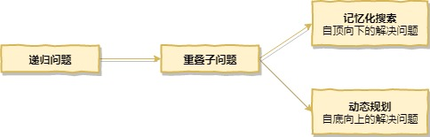

## 一、数组中的问题其实最常见

- [x] [283. Move Zeroes](https://leetcode.com/problems/move-zeroes/)
- [x] [027. Remove Element](https://leetcode.com/problems/remove-element/)
- [x] [026. Remove Duplicates from Sorted Array](https://leetcode.com/problems/remove-duplicates-from-sorted-array/)
- [ ] [080. Remove Duplicates from Sorted Array II](https://leetcode.com/problems/remove-duplicates-from-sorted-array-ii/)
- [x] [075. Sort Colors](https://leetcode.com/problems/sort-colors/) 
- [x] [088. Merge Sorted Array](https://leetcode.com/problems/merge-sorted-array/)
- [x] [215. Kth Largest Element in an Array](https://leetcode.com/problems/kth-largest-element-in-an-array/) 
- [x] [167. Two Sum II - Input array is sorted](https://leetcode.com/problems/two-sum-ii-input-array-is-sorted/)
- [x] [125. Valid Palindrome](https://leetcode.com/problems/valid-palindrome/)
- [x] [344. Reverse String](https://leetcode.com/problems/reverse-string/)
- [x] [345. Reverse Vowels of a String](https://leetcode.com/problems/reverse-vowels-of-a-string/)
- [x] [11. Container With Most Water](https://leetcode.com/problems/container-with-most-water/)
- [x] [209. Minimum Size Subarray Sum](https://leetcode.com/problems/minimum-size-subarray-sum/)
- [x] [003. Longest Substring Without Repeating Characters](https://leetcode.com/problems/longest-substring-without-repeating-characters/)
- [ ] [438. Find All Anagrams in a String](https://leetcode.com/problems/find-all-anagrams-in-a-string/)
- [ ] [076. Minimum Window Substring](https://leetcode.com/problems/minimum-window-substring/)

## 二、查找表相关问题

- [x] [349. Intersection of Two Arrays](https://leetcode.com/problems/intersection-of-two-arrays/)
- [x] [350. Intersection of Two Arrays II](https://leetcode.com/problems/intersection-of-two-arrays-ii/)
- [x] [242. Valid Anagram](https://leetcode.com/problems/valid-anagram/)
- [x] [202. Happy Number](https://leetcode.com/problems/happy-number/)
- [x] [290. Word Pattern](https://leetcode.com/problems/word-pattern/)
- [x] [205. Isomorphic Strings](https://leetcode.com/problems/isomorphic-strings/)
- [ ] [451. Sort Characters By Frequency](https://leetcode.com/problems/sort-characters-by-frequency/)
- [ ] [015. 3Sum](https://leetcode.com/problems/3sum/)
- [ ] [018. 4Sum]()
- [ ] [016. 3Sum Closest](<https://leetcode.com/problems/3sum-closest/>)
- [ ] [454. 4Sum II](<https://leetcode.com/problems/4sum-ii/>)
- [ ] [049. Group Anagrams](<https://leetcode.com/problems/group-anagrams/>)
- [ ] [447. Number of Boomerangs](<https://leetcode.com/problems/number-of-boomerangs/>)
- [ ] [149. Max Points on a Line](<https://leetcode.com/problems/max-points-on-a-line/>)
- [ ] [219. Contains Duplicate II](<https://leetcode.com/problems/contains-duplicate-ii/>)
- [ ] [217. Contains Duplicate](<https://leetcode.com/problems/contains-duplicate/>)
- [ ] [220. Contains Duplicate III](<https://leetcode.com/problems/contains-duplicate-iii/>)

## 三、在链表中穿针引线

- [x] [206. Reverse Linked List](https://leetcode.com/problems/reverse-linked-list/)
- [x] [092. Reverse Linked List II](https://leetcode.com/problems/reverse-linked-list-ii/)
- [x] [083. Remove Duplicates from Sorted List](https://leetcode.com/problems/remove-duplicates-from-sorted-list/)
- [x] [086. Partition List](https://leetcode.com/problems/partition-list/)
- [x] [328. Odd Even Linked List](https://leetcode.com/problems/odd-even-linked-list/)
- [x] [002. Add Two Numbers](https://leetcode.com/problems/add-two-numbers/)
- [ ] [445. Add Two Numbers II](https://leetcode.com/problems/add-two-numbers-ii/)
- [x] [203. Remove Linked List Elements](https://leetcode.com/problems/remove-linked-list-elements/)
- [x] [082. Remove Duplicates from Sorted List II](https://leetcode.com/problems/remove-duplicates-from-sorted-list-ii/)
- [x] [021. Merge Two Sorted Lists](https://leetcode.com/problems/merge-two-sorted-lists/)
- [x] [024. Swap Nodes in Pairs](https://leetcode.com/problems/swap-nodes-in-pairs/)
- [ ] [025. Reverse Nodes in k-Group](https://leetcode.com/problems/reverse-nodes-in-k-group/)
- [x] [147. Insertion Sort List](https://leetcode.com/problems/insertion-sort-list/)
- [ ] [148. Sort List](https://leetcode.com/problems/sort-list/)
- [x] [237. Delete Node in a Linked List](https://leetcode.com/problems/delete-node-in-a-linked-list/) 
- [x] [019. Remove Nth Node From End of List](https://leetcode.com/problems/remove-nth-node-from-end-of-list/)
- [x] [061. Rotate List](https://leetcode.com/problems/rotate-list/)
- [ ] [143. Reorder List](https://leetcode.com/problems/reorder-list/)
- [ ] [234. Palindrome Linked List](https://leetcode.com/problems/palindrome-linked-list/)

## 四、栈、队列、优先队列

### 1. 栈

* 栈的基础使用
  * [x] [020. Valid Parentheses](<https://leetcode.com/problems/valid-parentheses/>)
  * [x] [150. Evaluate Reverse Polish Notation](<https://leetcode.com/problems/evaluate-reverse-polish-notation/>)
  * [x] [071. Simplify Path](<https://leetcode.com/problems/simplify-path/>)

### 2. 栈和递归的紧密关系

* 二叉树的遍历

  可以使用递归、经典非递归、与模拟系统栈3种方法实现

  - [x] [144. Binary Tree Preorder Traversal](<https://leetcode.com/problems/binary-tree-preorder-traversal/>)
  - [x] [094. Binary Tree Inorder Traversal](<https://leetcode.com/problems/binary-tree-inorder-traversal/>)
  - [x] [145. Binary Tree Postorder Traversal](<https://leetcode.com/problems/binary-tree-postorder-traversal/>)

* 练习
  
  * [ ] [341. Flatten Nested List Iterator](<https://leetcode.com/problems/flatten-nested-list-iterator/>)

### 3. 队列

* 队列的基本应用-广度优先遍历
  - [ ] [102. Binary Tree Level Order Traversal](<https://leetcode.com/problems/binary-tree-level-order-traversal/>)
  - [ ] [107. Binary Tree Level Order Traversal II](<https://leetcode.com/problems/binary-tree-level-order-traversal-ii/>)
  - [ ] [103. Binary Tree Zigzag Level Order Traversal](<https://leetcode.com/problems/binary-tree-zigzag-level-order-traversal/>)
  - [ ] [199. Binary Tree Right Side View](<https://leetcode.com/problems/binary-tree-right-side-view/>)
* BFS和图的最短路径
  - [ ] [279. Perfect Squares](<https://leetcode.com/problems/perfect-squares/>)
  - [ ] [127. Word Ladder](<https://leetcode.com/problems/word-ladder/>)
  - [ ] [126. Word Ladder II](<https://leetcode.com/problems/word-ladder-ii/>)

### 4. 优先队列

* 优先队列也是一种队列，底层使用堆来实现。统计频率，排序优先队列，O(nlogk)优先队列，O(nlog(n-k))
* 347号题有3种解题思路统计频率，排序优先队列，O(nlogk)优先队列，O(nlog(n-k))
  * [ ] [347. Top K Frequent Elements](<https://leetcode.com/problems/top-k-frequent-elements/>)
  * [ ] [23. Merge k Sorted Lists](<https://leetcode.com/problems/merge-k-sorted-lists/>)

## 五、二叉树和递归

* [x] [104. Maximum Depth of Binary Tree](https://leetcode.com/problems/maximum-depth-of-binary-tree)
* [x] [111. Minimum Depth of Binary Tree](https://leetcode.com/problems/minimum-depth-of-binary-tree)
* [x] [226. Invert Binary Tree](https://leetcode.com/problems/invert-binary-tree)
* [x] [100. Same Tree](https://leetcode.com/problems/same-tree)
* [x] [101. Symmetric Tree](https://leetcode.com/problems/symmetric-tree)
* [x] [222. Count Complete Tree Nodes](https://leetcode.com/problems/count-complete-tree-nodes)
* [ ] [110. Balanced Binary Tree](https://leetcode.com/problems/balanced-binary-tree)
* [ ] [112. Path Sum](https://leetcode.com/problems/path-sum)
* [ ] [404. Sum of Left Leaves](https://leetcode.com/problems/sum-of-left-leaves)
* [ ] [257. Binary Tree Paths](https://leetcode.com/problems/binary-tree-paths)
* [ ] [113. Path Sum II](https://leetcode.com/problems/path-sum-ii)
* [ ] [129. Sum Root to Leaf Numbers](https://leetcode.com/problems/sum-root-to-leaf-numbers)
* [ ] [437. Path Sum III](https://leetcode.com/problems/path-sum-iii)
* [ ] [235. Lowest Common Ancestor of a Binary Search Tree](https://leetcode.com/problems/lowest-common-ancestor-of-a-binary-search-tree)
* [ ] [098. Validate Binary Search Tree](https://leetcode.com/problems/validate-binary-search-tree)
* [ ] [450. Delete Node in a BST](https://leetcode.com/problems/delete-node-in-a-bst)
* [ ] [108. Convert Sorted Array to Binary Search Tree](https://leetcode.com/problems/convert-sorted-array-to-binary-search-tree)
* [ ] [230. Kth Smallest Element in a BST](https://leetcode.com/problems/kth-smallest-element-in-a-bst)
* [ ] [236. Lowest Common Ancestor of a Binary Tree](https://leetcode.com/problems/lowest-common-ancestor-of-a-binary-tree)

## 六、递归和回溯

- [ ] [017. Letter Combinations of a Phone Number](https://leetcode.com/problems/letter-combinations-of-a-phone-number)
- [ ] [093. Restore IP Addresses](https://leetcode.com/problems/restore-ip-addresses)
- [ ] [131. Palindrome Partitioning](https://leetcode.com/problems/palindrome-partitioning)
- [ ] [046. Permutations](https://leetcode.com/problems/permutations)
- [ ] [047. Permutations II](https://leetcode.com/problems/permutations-ii)

## 七、动态规划基础

**动态规划：**将原问题拆解成若干的子问题，同时保存子问题的答案使得每个子问题只求解一次，最终获得原问题的答案。

- [x] [070. Climbing Stairs](https://leetcode.com/problems/climbing-stairs)
- [x] [120. Triangle](https://leetcode.com/problems/triangle)
- [x] [064. Minimum Path Sum](https://leetcode.com/problems/minimum-path-sum)

**最优子结构：**通过求子问题的最优解，可以获得原问题的最优解。

- [x] [343. Integer Break](https://leetcode.com/problems/integer-break)
- [ ] [279. Perfect Squares](https://leetcode.com/problems/perfect-squares)
- [ ] [091. Decode Ways](https://leetcode.com/problems/decode-ways)
- [ ] [062. Unique Paths](https://leetcode.com/problems/unique-paths)
- [ ] [063.Unique Paths II](https://leetcode.com/problems/unique-paths-ii)

